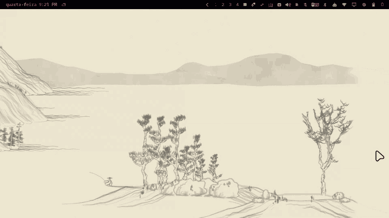

# zed.shanshui

An endless Chinese landscape scroll painted on your Omarchy desktop, stroke by
stroke, left to right, in your theme's colors.


The mountains are [{Shan, Shui}\*](https://github.com/LingDong-/shan-shui-inf)
by LingDong-: procedural landscapes in the manner of the old handscrolls, made
of noise and pen strokes. This plugin turns them into a slow, continuous
painting. A painting front walks to the right. Far mountains go first, and the
near hills, trees, huts and boats follow a little behind it. The paper keeps
unrolling, and the landscape never repeats.

It is built to be almost free:
- The drawing is done **outside the shell**, at the lowest CPU priority.
- On screen it is **one small shader** comparing two numbers per pixel.
- Paused, turned off, or under a fullscreen window, it costs **nothing**.

Interface in **English or Portuguese**, picked in the menu (defaults to the
machine's locale).

> 🇧🇷 A versão em português deste documento está em
> [README.pt-BR.md](README.pt-BR.md).

---

## Install

From the marketplace listing, or straight from git:

```sh
omarchy plugin add https://github.com/zednaked/omarchy-shanshui --enable
omarchy-restart-shell
```

The restart is needed. Omarchy starts Quickshell with
`QS_DISABLE_FILE_WATCHER=1`, so a freshly copied plugin is not picked up until
the shell comes back. The first landscape starts painting a few seconds later.

To place the bar widget by hand, add one line in `~/.config/omarchy/shell.json`
under `bar.layout.left`, `center` or `right`:

```jsonc
{ "id": "zed.shanshui" }
```

## Remove

```sh
omarchy plugin remove zed.shanshui
omarchy-restart-shell
```

That takes the plugin out of `~/.config/omarchy/plugins/` and its id out of
`shell.json`. Your wallpaper was never touched: the painting is a layer above
it, and when the layer goes the wallpaper is simply there again.

The plugin keeps three small folders of its own, which are not removed with it.
To delete them too:

```sh
rm -rf ~/.config/zed.shanshui ~/.local/state/zed.shanshui ~/.cache/zed.shanshui
```

**Requirements:** Omarchy with `omarchy-shell` (plugin schemaVersion 1), and:

| | why | on Omarchy |
|---|---|---|
| `nodejs` | runs the landscape generator, outside the shell | **not installed by default:** install the `nodejs` package with your package manager, or use a `node` from mise |
| `librsvg` (`rsvg-convert`) | turns the generated SVG into images | already there |

When one is missing, the menu says which one.

---

## The menu

Click 山 in the bar:

- **On/off** switch. Right-clicking 山 does the same without opening the menu.
- **Pause**, **Skip ahead** (half a screen), and **New landscape**. A new
  landscape starts on blank paper and paints the first screen in a few seconds.
- **Speed**, as the time the front takes to cross one screen: 10 min, 5 min,
  2 min, 1 min, 30 s, 15 s.
- **Motion**: Light (6 fps), Normal (12 fps), Smooth (24 fps). This is the
  main cost. Fast speeds look best with Smooth.
- **Colors**:
  - **Theme**: the theme's foreground on its background.
  - **Accent**: the accent color on the background.
  - **Rice paper**: dark ink on cream paper, whatever the theme.
  - **Invert colors** swaps ink and paper in any of the three.

  Changing the theme repaints instantly.

  
- **Language**: Português or English.

## How it works

The landscape is cut into **strips**, each the width of the screen. For each
strip, `gerar.js` makes two images:
- **The painting**, in neutral grey: 0 is ink, 1 is paper.
- **A delay map**: for each pixel, how far behind the painting front that
  stroke is laid.

The delay comes only from the element itself. Depth sets most of it, so far
mountains come before near hills. The stroke's order inside the element sets
the rest, so outlines come before texture. The world is the same no matter
which strip is drawn, so two neighbouring strips match pixel for pixel, and
`make emenda` checks exactly that.

On screen, each strip is a `ShaderEffect`:
- A pixel appears when the front passes its x plus its delay.
- A slow noise makes the front edge irregular, like a brush.
- The paper grain is added there too.
- Ink and paper colors are applied in the shader, which is why changing the
  theme, palette or inversion never generates anything.

The camera follows the front, and only the strips on screen, plus the next one
when it gets close, are kept in memory.

Every strip has its own seed per 512-unit chunk (`seed|x`). So a strip far
into the scroll does not need everything before it, and a strip already drawn
is reused from `~/.cache/zed.shanshui` after a restart.

## Cost

Measured on a Ryzen 9 5900HS laptop (Radeon iGPU, 1920×1080 at 1.5× scale, so 2560×1440 strips), as the
share of one core. These are noisy numbers: the shell and Hyprland also serve
the tray, the bar and everything else.

| | shell | Hyprland | iGPU |
|---|---|---|---|
| off, paused, or under fullscreen | = baseline | = baseline | = baseline |
| Light (6 fps) | +2–3% | +1–2% | ~5–10% |
| Normal (12 fps) | +2–3% | +1–2% | ~6–9% |
| Smooth (24 fps) | +5–15% | +3–5% | ~11–19% |

Each new strip costs 3–7 s of one core in `node` + `rsvg-convert`, at
`nice 19`. At 5 min per screen that is a strip every 5 minutes; at 15 s per
screen, one every 15 s, which does add up. The shell only holds the images:
about 18 MB per strip.

## Settings

The menu writes `~/.config/zed.shanshui/config.json`, and the file reloads by
itself. Two keys are only there:

```jsonc
{
  "frenteNaTela": 1.0,  // where the front sits on screen (0 left, 1 right edge)
  "espalha": 140,       // how far behind the front the details are laid (world units; the view is 700 tall)
  "suave": 40,          // width of the soft edge where ink comes in
  "grao": 0.06          // paper grain
}
```

`tinta` and `papel` (ink and paper) also accept any `#rrggbb`, or `foreground`,
`background`, `accent`, `muted`, `urgent` from the theme.

## IPC

```sh
omarchy-shell shanshui pausar | continuar | nova | ligar | desligar | alternar | estado
omarchy-shell shanshui pular 0.5     # move the front half a screen
omarchy-shell zed.shanshui.menu toggle
```

## What it touches

- **Writes:** only its own three folders, `~/.config/zed.shanshui`,
  `~/.local/state/zed.shanshui` and `~/.cache/zed.shanshui`. It never touches
  `shell.json`, the wallpaper or any other config of yours.
- **Disk writes go through `gerar.js`:**
  - Each folder is opened by walking down from `$HOME` one component at a time,
    refusing a symlink anywhere on the way and any component that someone
    else can write to (`O_DIRECTORY | O_NOFOLLOW`, owner and mode checked on
    the descriptor, then `/proc/self/fd/N/name` as `openat`).
  - Each file is written to a random temporary name
    (`O_CREAT | O_EXCL | O_NOFOLLOW`), fsynced, and renamed through the same
    directory descriptor.
  - File names are built there from numbers only.
- **Processes:** every one runs with a clean environment (`PATH`, `HOME`) and no
  shell. There is no network access, no binary in the repo, and no service
  outside the shell.
- `make hostil` shows what it refuses: a symlink on the path, a folder outside
  `$HOME`, `..`, a seed that is not a number, a link, hardlink or FIFO put where
  a strip goes, a group- or world-writable folder on the path.

## Files

```
manifest.json      schemaVersion 1, kinds service + bar-widget
qmldir             singleton Paisagem
Paisagem.qml       the front, the camera, the strips, settings, IPC
Service.qml        one layer-shell window per monitor, one ShaderEffect per strip
BarWidget.qml      山 and the menu
pintura.frag       the reveal shader (pintura.frag.qsb is its compiled form)
gerar.js           strips, cleanup and folders - the only code that writes to disk
shanshui.js        LingDong-'s generator, browser parts removed
test/              hostil, determinismo, emenda
```

## Tests

```sh
make test       # hostil + determ + emenda
make validate   # omarchy plugin validate .
make shader     # rebuild pintura.frag.qsb (qt6-shadertools)
```

---

MIT. The mountains are LingDong-'s; the scroll is ZeD's; the bar is Omarchy's.
