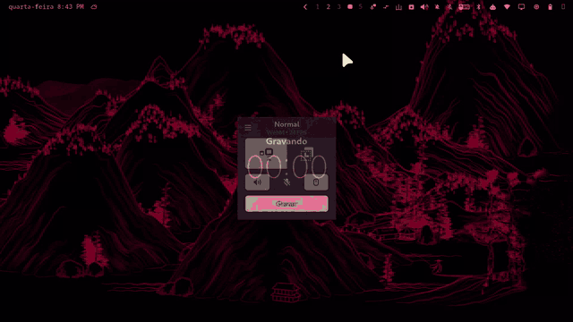

# zed.shanshui

Uma pintura de paisagem chinesa sem fim, pintada no fundo do Omarchy traço por
traço, da esquerda para a direita, nas cores do tema.



As montanhas são do [{Shan, Shui}\*](https://github.com/LingDong-/shan-shui-inf),
de LingDong-: paisagens procedurais no jeito dos rolos antigos, feitas de ruído
e traço de pena. O plugin transforma aquilo numa pintura lenta e contínua. Uma
frente de pintura caminha para a direita. As montanhas do fundo vão na
dianteira, e os morros da frente, as árvores, as casas e os barcos vêm logo
atrás. O papel vai correndo, e a paisagem não se repete.

Foi feito para custar quase nada:
- O desenho acontece **fora do shell**, na menor prioridade de CPU.
- Na tela é **um shader pequeno**, que compara dois números por pixel.
- Pausado, desligado ou atrás de uma janela em tela cheia, custa **zero**.

Menu em **português ou inglês**, escolhido no próprio menu. O padrão é a língua
do sistema.

---

## Instalar

Pela listagem do marketplace, ou direto do git:

```sh
omarchy plugin add https://github.com/zednaked/omarchy-shanshui --enable
omarchy-restart-shell
```

O restart é necessário. O Omarchy sobe o Quickshell com
`QS_DISABLE_FILE_WATCHER=1` de propósito, então plugin recém-copiado só aparece
quando o shell volta. A primeira paisagem começa a ser pintada poucos segundos
depois.

Para pôr o ícone na barra à mão, uma linha no `~/.config/omarchy/shell.json`,
em `bar.layout.left`, `center` ou `right`:

```jsonc
{ "id": "zed.shanshui" }
```

## Remover

```sh
omarchy plugin remove zed.shanshui
omarchy-restart-shell
```

Isso tira o plugin de `~/.config/omarchy/plugins/` e o id dele do `shell.json`.
O seu wallpaper nunca foi tocado: a pintura é uma camada por cima dele, e sem a
camada ele simplesmente volta a aparecer.

O plugin guarda três pastinhas próprias, que não saem junto. Para apagar também:

```sh
rm -rf ~/.config/zed.shanshui ~/.local/state/zed.shanshui ~/.cache/zed.shanshui
```

**Requisitos:** Omarchy com `omarchy-shell` (plugin schemaVersion 1), e mais:

| | para quê | no Omarchy |
|---|---|---|
| `nodejs` | roda o gerador da paisagem, fora do shell | **não vem instalado:** `omarchy pkg add nodejs`, ou um `node` do mise |
| `librsvg` (`rsvg-convert`) | transforma o SVG gerado em imagem | já vem |

Se faltar um, o menu diz qual é e como instalar.

---

## O menu

Clique no 山 da barra:

- **Liga/desliga.** O botão direito no 山 faz o mesmo sem abrir o menu.
- **Pausar**, **Adiantar** (meia tela) e **Outra paisagem**. A paisagem nova
  começa numa folha em branco e pinta a primeira tela em poucos segundos, sem
  ficar minutos vazia.
- **Velocidade**, como o tempo que a frente leva para atravessar uma tela:
  10 min, 5 min, 2 min, 1 min, 30 s, 15 s.
- **Fluidez**: Leve (6 fps), Normal (12 fps), Suave (24 fps). É o que mais pesa.
  Nas velocidades rápidas, a Suave é a que fica bonita.
- **Cores**:
  - **Tema**: o foreground do tema sobre o background.
  - **Acento**: a cor de acento sobre o background.
  - **Papel de arroz**: tinta escura em papel creme, seja qual for o tema.
  - **Inverter cores** troca tinta e papel em qualquer uma das três.

  Trocar de tema repinta na hora.
- **Idioma**: Português ou English.

No rodapé, o crédito ao LingDong- e a assinatura.

## Como funciona

A paisagem é cortada em **faixas** da largura da tela. Para cada faixa, o
`gerar.js` faz duas imagens:
- **O quadro**, em cinza neutro: 0 é tinta, 1 é papel.
- **Um mapa de atraso**: para cada pixel, quanto aquele traço vem atrás da
  frente de pintura.

O atraso vem só do próprio elemento. A profundidade decide a maior parte: a
montanha distante vem antes do morro da frente. A ordem do traço dentro do
elemento decide o resto: o contorno vem antes da textura. O mundo é o mesmo
seja qual for a faixa desenhada. Por isso, duas faixas vizinhas batem pixel a
pixel, e o `make emenda` confere exatamente isso: em três sementes, zero pixels
diferentes.

Na tela, cada faixa é um `ShaderEffect`:
- Um pixel aparece quando a frente passa do x dele somado ao atraso.
- Um ruído lento deixa a borda da frente irregular, como pincel.
- O grão do papel também é posto ali.
- As cores de tinta e papel são aplicadas no shader. Por isso, trocar tema,
  paleta ou inverter nunca gera nada de novo.

A câmera acompanha a frente, e só ficam na memória as faixas na tela, mais a
próxima quando ela se aproxima.

Cada pedaço de 512 unidades do mundo tem a própria semente (`semente|x`). Uma
faixa lá adiante no rolo não precisa gerar tudo o que veio antes. E faixa já
desenhada é reaproveitada do `~/.cache/zed.shanshui` depois de um restart.

### Por que node e não QML puro

O gerador original tem umas 3.900 linhas de JavaScript. Rodar isso dentro do
shell pesaria no mesmo processo em que a barra mora. Fora dele, o custo é de um
processo descartável com `nice 19`, que o sistema pode adiar à vontade. E o
SVG → PNG ficou com o `rsvg-convert` (librsvg, que o Omarchy já traz), e não
com o QtSvg: o do Qt implementa só o perfil SVG 1.2 Tiny, e o mapa de atraso
depende de `shape-rendering="crispEdges"` para não inventar instantes nas
bordas.

## Custo

Medido num Ryzen 9 5900HS (iGPU Radeon, 1920×1080 com escala 1,5×, portanto
faixas de 2560×1440), em fração de um núcleo. São números ruidosos, porque o
shell e o Hyprland também servem o tray, a barra e todo o resto.

| | shell | Hyprland | iGPU |
|---|---|---|---|
| desligado, pausado ou sob tela cheia | = base | = base | = base |
| Leve (6 fps) | +2–3% | +1–2% | ~5–10% |
| Normal (12 fps) | +2–3% | +1–2% | ~6–9% |
| Suave (24 fps) | +5–15% | +3–5% | ~11–19% |

Cada faixa nova custa de 3 a 7 s de um núcleo em `node` + `rsvg-convert`, com
`nice 19`:
- a 5 min por tela, é uma faixa a cada 5 minutos;
- a 15 s por tela, é uma a cada 15 s, e aí soma.

O shell só guarda as imagens: umas 18 MB por faixa.

## Ajustes

O menu escreve em `~/.config/zed.shanshui/config.json`, que recarrega sozinho.
Quatro chaves só existem lá:

```jsonc
{
  "frenteNaTela": 1.0,  // onde a frente fica na tela (0 esquerda, 1 borda direita)
  "espalha": 140,       // quanto os detalhes vêm atrás da frente (em unidades do mundo; a vista tem 700 de altura)
  "suave": 40,          // largura da borda em que a tinta entra
  "grao": 0.06          // grão do papel
}
```

`tinta` e `papel` aceitam qualquer `#rrggbb`, ou `foreground`, `background`,
`accent`, `muted` e `urgent` do tema.

## IPC

```sh
omarchy-shell shanshui pausar | continuar | nova | ligar | desligar | alternar | estado
omarchy-shell shanshui pular 0.5     # anda a frente meia tela
omarchy-shell zed.shanshui.menu toggle
```

## O que ele toca

- **Escreve** só nas três pastas dele: `~/.config/zed.shanshui`,
  `~/.local/state/zed.shanshui` e `~/.cache/zed.shanshui`. Nunca em
  `shell.json`, no wallpaper nem em outra config sua.
- **Gravação em disco passa pelo `gerar.js`:**
  - Cada pasta é aberta descendo do `$HOME` componente por componente, recusando
    symlink em qualquer ponto e componente em que outro possa escrever
    (`O_DIRECTORY | O_NOFOLLOW`, dono e modo conferidos no descritor, e
    `/proc/self/fd/N/nome` fazendo as vezes de `openat`).
  - Cada arquivo é escrito num temporário de nome aleatório
    (`O_CREAT | O_EXCL | O_NOFOLLOW`), com fsync, e renomeado pelo mesmo
    descritor de diretório.
  - O nome do arquivo é montado lá, só com números.
- **Processos:** todos rodam com ambiente limpo (`PATH`, `HOME`) e sem shell.
  Não há rede, binário no repositório nem serviço fora do shell.
- O `make hostil` mostra o que ele recusa: symlink no caminho, pasta fora do
  `$HOME`, `..`, semente que não é número, link, hardlink ou FIFO posto onde
  vai uma faixa, pasta com escrita para o grupo ou para outros no caminho.

## Arquivos

```
manifest.json      schemaVersion 1, kinds service + bar-widget
qmldir             singleton Paisagem
Paisagem.qml       a frente, a câmera, as faixas, os ajustes, o IPC
Service.qml        uma janela layer-shell por monitor, um ShaderEffect por faixa
BarWidget.qml      o 山 e o menu
pintura.frag       o shader que revela (pintura.frag.qsb é ele compilado)
gerar.js           faixas, limpeza e pastas - o único código que escreve em disco
shanshui.js        o gerador do LingDong-, sem as partes de navegador
test/              hostil, determinismo, emenda
PUBLISHING.md      o que falta e o que preencher para o marketplace
```

## Testes

```sh
make test       # hostil + determ + emenda
make validate   # omarchy plugin validate .
make shader     # recompila o pintura.frag.qsb (qt6-shadertools)
```

---

MIT. As montanhas são do LingDong-; o rolo é do ZeD; a barra é do Omarchy.
